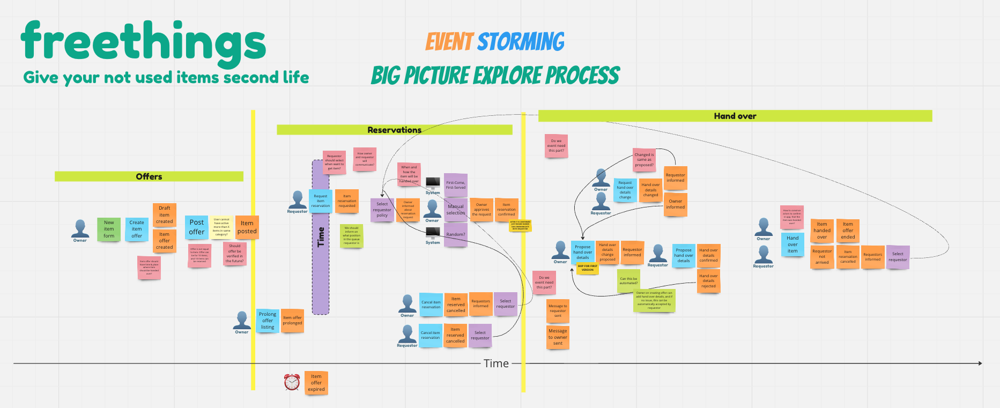

## Idea

The ideas of this project is to create a platform with same concept as "Uwaga Śmieciarka Jedzie" FB group, where people can share things they don't need anymore, but are still in good condition. The main goal is to reduce waste and give things a second life.

My idea is to improve the concept and extend this, that really valuable things can be shared for charity purposes.

## Features
- [ ] **User registration and profiles**: Allow users to create profiles, where they can list items, express interest in items, and track their donations or acquisitions.
- [ ] **Item Listings**: Users can list items they want to give away. Listings should include a title, description, and photo.
- [ ] **Item Search**: Users can search for items they are interested in.
- [ ] **Interest Expression Mechanism**: Possibility to select how you want to give away your item:
  - [x] **First-Come, First-Served Option**: The first user to express interest is automatically granted the item. 
  - [x] **New Owner Manual Selection**: The owner reviews interested parties and selects who receives the item.
  - [ ] **Bidding for Charity**: An auction-like feature where the highest pledge to a selected charity wins the item.pledge to a selected charity wins the item.

## Tech Stack & Ideology behing the project

Behind building the working MVP of the project, I want to to focus on delivering a high-quality code, that is easy to maintain and extend. I want to start from really basic Web API and using evolutionary-approach extend it finding new contexts and features. Initially I will start from simple monolith app, but I believe I will be able to modularize it during the development process.

### Tech stack
- **.NET 8.0, Minimal API** - this is my main technology stack. I want to use the newest version of .NET and the new Minimal API feature, which is a really interesting approach to building Web APIs. I feel comfortable with C# and .NET, so I think it's a good choice for me.
- ~~**Vue.js + Nuxt.js + Typescript** - I have lack of experience in using frontend frameworks so this will be a great opportunity for me to finally build some working concept with Vue.js. I want to use Typescript to make the code more maintainable and to learn it better.~~

### Analysis & exploration

Here is link to Miro, where I'm exploring the domain: [freethings miro](https://miro.com/app/board/uXjVNl71hrg=/?share_link_id=521419360509)

### Technical infrastructure

- The application will be hosted on Azure.
  - Azure Container Apps for hosting the application.
  - Database (to be decided). (Primarily I use SQL Server, so thinking about using other provider to learn something new).
  - Azure Blob Storage for storing images.
  - Authentication & Authorization (TBD).
  - SignalR for real-time communication (TBD).
  - Message broker (TBD).
    - Only in memory? (TBD) 
    - Azure Service Bus - Pub/Sub not available in free tier.
    - RabbitMQ (TBD)
- CI/CD
  - Github Actions.

## How to run

1. Run `docker-compose.yml` located in the `source/backend/Freethings/Freethings`.
2. Using connection string `Server=localhost,1435;Database=master;User=sa;Password=FreethingsSql1!;` login to database and create database called `freethings`.

### Running migrations

`dotnet ef migrations add "Init" -o Infrastructure/Offers/Persistence/Migrations -p Freethings/Freethings.csproj -c OffersContext`
`dotnet ef database update -p Freethings/Freethings.csproj -c OffersContext`

