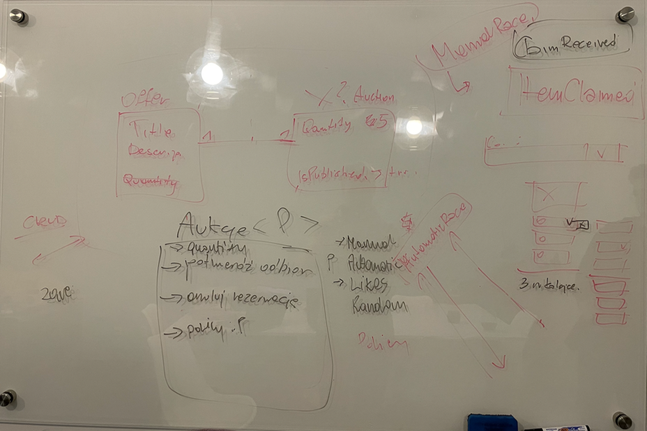

### 20.03.2024 - day 20

Plan for the day:
- [ ] Continuation of restructure the Readme.md and create docs folder.
- [ ] Prepare plan for next week.
- [ ] Start using Github project && issues.

### 19.03.2024 - day 19

I need to restructure the Readme.md and create a `docs` folder. Unfortunately, I see that my plan was not enough detailed. Here I want to plan work on the daily basis.

Plan for the day:
- [x] Restructure the Readme.md and create docs folder.
- [ ] Decide the namings of the modules. Now there is Auction/Adveritisement and more.

#### Decisions
- As I'm exploring the domain I want to fully focus on backend and leave the frontend part for now.

### 14.03.2024 - day 14

After the 13.03.2024 analysis, the miro storming was recreated. Based on that, more precise requirements were created:

- User can create offers of items which she/he wants to give for free to other platform members.
- User can specify item details (photo, description, title, category) of the item.
- User can specify quantity, if offer is about more than one same item.
- User can specify type of the offer - which will trigger the way, the claims will be considered.
- User can mark offer as published - after this action, the item advertisement/auction will be created.
- Interesants can claims item(s) from advertisement/auction.
- Even if all items are already reserved, interesants can still claim item(s).
- Item is reserved until the interesant will receive them. After receiving the item, reservation is ended, available quantity on the advertisement is updated. Quantity is also updated in the offer.
- User can modify the offer quantity.
    - If any reservations are made, they will be cancelled accordingly.
- User can cancel the offer.
    - If any reservations are made, they will be cancelled accordingly.

Example lifecycle othe the offer was created:

### 13.03.2024 - day 13

Today's work was focused on exploring and analyzing the domain, as the initial analysis did not do it with needed deepnest. Result of today's work is a image of the board with was created. Next days I will try to materialize it on Miro and base domain model.

